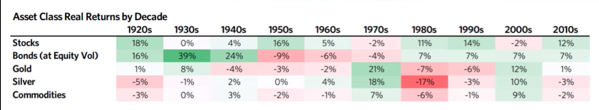

# paradigm

This repo is to capture the cyclic change of requirement of portfolio-change upon the global macro economy.
The repo generates the best profitable portfolio construction based on the given unit period of time.
`Ray Dalio` prefers to use the 10 year as a unit period of time to capture the change of best portfolio, however, this repo is prepared to provide more flexibility to that artificial dissection.

# Key Questions to Solve

- 